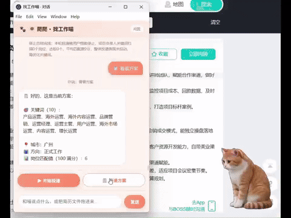
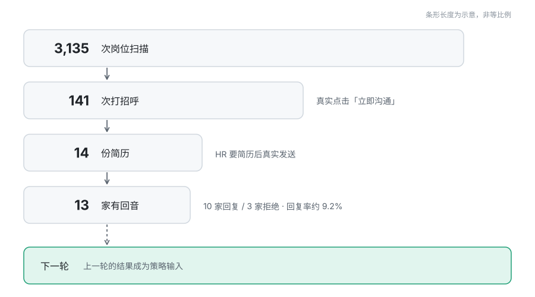
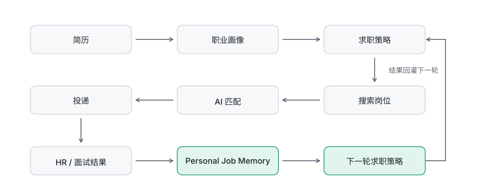
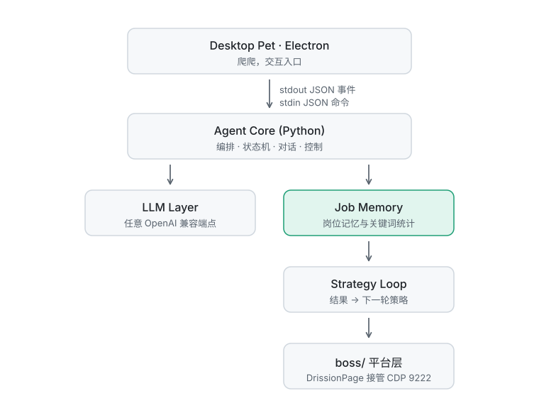

<p align="center">
  
</p>

# 🐱 JobHunter Cat · 找工作喵

> **一只住在你桌面上的 AI 求职 Agent。**
>
> **A desktop AI agent that searches, evaluates and applies for jobs — then learns from the results.**
>
> **不只是自动投递，而是会记住什么对你有效的个人求职 Agent。**
>
> **Not just auto-apply. A personal job-search agent that remembers what worked.**

<div align="center">
  
  <br>
  <sub>▶ 完整版视频（25 秒）：<a href="assets/demo.mp4">demo.mp4</a></sub>
</div>

<br>

**简历 → 求职策略 → 搜索岗位 → AI 匹配 → 自动投递 → HR 监控 → 结果分析 → 下一轮策略优化**

**Resume → Strategy → Search → AI Match → Auto-Apply → HR Monitoring → Result Analysis → Next-Round Optimization**

<sub>中英双语：每段先中文，后接对应英文。 / Bilingual: each Chinese paragraph is followed by its English counterpart.</sub>

---

## ⚠️ 先说清楚：它会真的给 HR 发消息 / Read This First: It Really Messages HR

这不是演示程序。**打招呼、发简历、回复都是真实动作，发出去就收不回来。**

This is not a demo. **Greetings, resume sends and replies are real actions — once sent, they cannot be taken back.**

但它**只在两种情况下主动开口**：HR 要简历（自动发简历）、HR 拒绝（自动回致谢）。
**约面试、谈薪资这类需要你判断的对话，它只提醒、不代答** —— 详见「HR 消息监控」。

But it **only speaks up in two situations**: when HR asks for your resume (it sends it automatically) and when HR declines (it sends a thank-you). **For anything that needs your judgment — interview scheduling, salary negotiation — it only notifies you and never replies on your behalf.** See "HR Message Monitoring".

请务必 / Please make sure to:

1. **投递前确认简历、关键词、薪资、城市都是你要的**<br>Confirm that your resume, keywords, salary range and city are what you actually want before applying
   > ⚠️ 本项目**没有演练模式，也没有只读试跑** ——
   > 界面上的「开始投递」点了就是真实投递，没有「先试一下」的选项。
   >
   > ⚠️ There is **no dry-run mode and no read-only trial** — clicking "Start Applying" performs a real application. There is no "just try it" option.
2. 用你自己的账号，自己承担平台规则风险<br>Use your own account, and accept the platform's rules and risks yourself

**关于封号**：截至 2026-09-24，连续 5 天高强度使用（每天 5 小时以上）**未出现封号**。
程序内置了控频机制（达标岗位中随机跳过一部分，实测约 26% 的跳过属于此类），
但**这不构成任何保证** —— 平台规则随时可能变化，请自行评估并承担风险。

**On account bans**: as of 2026-09-24, five consecutive days of heavy use (5+ hours a day) produced **no bans**. Rate limiting is built in — a random share of qualifying jobs is skipped (about 26% of all skips are of this kind) — but **this is not a guarantee of any kind**. Platform rules can change at any time, so evaluate and accept the risk yourself.

项目**不接管账号密码** —— 它接管的是你**已经手动登录好**的浏览器。

The project **never handles your password** — it takes over a browser you have **already logged into yourself**.

---

## 🤔 为什么需要它 / Why It Exists

很多 AI 求职工具解决的问题是：

Most AI job-search tools solve this problem:

> 帮你找到岗位，然后帮你投出去。
>
> Help you find jobs, then help you apply.

找工作喵想解决的是另一个问题：

JobHunter Cat tries to solve a different one:

> **投完以后发生了什么？**
>
> **What happens after you apply?**

很多自动投递工具会告诉你投了多少，但不一定把这些结果进一步用于下一轮求职决策。

Many auto-apply tools tell you how many applications you sent, but they do not necessarily feed those results back into your next round of decisions.

以一次真实使用为例（2026-09-18 ~ 09-24，连续 7 天，数字取自程序自己的动作账本）：

Here is one real run (2026-09-18 to 09-24, seven consecutive days; figures come from the program's own action ledger):

<p align="center">
  
</p>

> **口径说明**：上图的 3,135 是**动作次数**，不是岗位数。同一个岗位在不同关键词、不同轮次下
> 会被反复扫到，所以次数大于实际岗位数 —— 按「岗位名 + 公司」去重后，跳过涉及的岗位约 985 个。
> **141 次打招呼 / 14 份简历 / 13 家有回音同样是动作计数，不是岗位数。**
>
> **On counting**: the 3,135 above is a count of **actions**, not of jobs. The same job gets scanned repeatedly under different keywords and in different rounds, so the count exceeds the number of distinct jobs — after de-duplicating by "job title + company", the skipped set covers about 985 jobs. **The 141 greetings / 14 resumes / 13 replies are likewise action counts, not job counts.**

这 3,135 次里有 **2,980 次是主动跳过**（95.1%）：

Of those 3,135 actions, **2,980 were deliberate skips** (95.1%):

| 跳过原因 / Reason | 次数 / Count | 占比 / Share |
|---|---|---|
| 匹配分不够 / Match score too low | 1,475 | 49.5% |
| 控频随机跳过 / Rate-limit random skip | 776 | 26.0% |
| 薪资不符 / Salary mismatch | 391 | 13.1% |
| 命中排除词（JD / 岗位名 / 标题）/ Matched an exclusion word (JD / job name / title) | 338 | 11.3% |

**95% 的扫描最终被筛掉** —— 这说明当前的筛选机制对投递数量做了明显控制。
至于这些筛选是否真的提高了**有效投递率**（而不是把好岗位也误杀了），
还需要更多真实数据才能判断，这也是本项目正在公开验证的假设之一。

**95% of scans end up filtered out** — the filtering clearly keeps application volume under tight control. Whether these filters actually raise the **effective application rate** (rather than killing good jobs along with the bad) needs more real data to judge, and that is one of the hypotheses this project is validating in public.

而这些跳过与投递都不是白记的 —— 它们会沉淀成关键词有效性
（下表来自岗位记忆的关键词维度统计，按关键词去重，与上面的动作次数口径不同）：

None of those skips or applications are wasted — they accumulate into keyword effectiveness (the table below comes from the keyword dimension of Job Memory, de-duplicated by keyword, a different counting basis from the action counts above):

| 关键词 / Keyword | 扫描 / Scanned | 投递 / Applied |
|---|---|---|
| 用户运营 / User Operations | 52 | **20** |
| 运营经理 / Operations Manager | 70 | 18 |
| 海外运营 / Overseas Operations | 64 | 16 |
| 内容运营 / Content Operations | 27 | 16 |
| 海外社媒运营 / Overseas Social Media Ops | 43 | **0** |

同样一批岗位，`用户运营` 投出去 20 个，`海外社媒运营` 扫了 43 个一个没投 ——
下一轮就该考虑把它换掉。这就是「记住什么对你有效」的具体样子。

Over the same pool of jobs, `User Operations` produced 20 applications while `Overseas Social Media Ops` scanned 43 and applied to none — next round, that keyword should probably be replaced. This is what "remembering what works for you" actually looks like.

第二轮时，AI 会发现：

In the second round, the AI can surface:

- 哪些关键词扫出来的岗位**回复率更高**<br>Which keywords produce jobs with a **higher reply rate**
- 哪些岗位匹配分不低，但**实际没什么反馈**<br>Which jobs score well yet **get little real feedback**
- 哪些方向**连续多轮没有有效回复**<br>Which directions have **seen no meaningful replies for several rounds**

于是下一轮不是简单重复搜索，而是**把历史结果当作新的决策依据**。

So the next round is not a simple repeat of the same search — it **treats past results as new decision input**.

---

## 🐱 为什么是找工作喵 / Why JobHunter Cat?

大多数求职自动化只解决一个动作：

Most job-search automation focuses on a single action:

> **找到岗位 → 投出去**
>
> **Find a job → Apply**

找工作喵探索的是一个更长的闭环：

JobHunter Cat explores a longer loop:

> **理解 → 规划 → 搜索 → 匹配 → 投递 → 观察 → 记忆 → 调整**
>
> **Understand → Plan → Search → Match → Apply → Observe → Remember → Adapt**

**桌面猫是交互入口，Agent 在背后干活；求职记忆保留上下文，策略引擎把过去的结果变成下一个决策。**

**The desktop cat is the interface. The Agent does the work. The Job Memory keeps the context. The Strategy Engine turns past results into future decisions.**

---

## 🧠 求职记忆 / Personal Job Memory

> **桌面猫是交互入口，求职记忆才是我们正在重点探索的核心能力。**
>
> **The desktop cat is the entry point, but Job Memory is the core capability we are actively exploring.**

它会持续记录你的求职过程：简历与职业经历、求职方向、城市与薪资偏好、岗位搜索记录、匹配结果、投递记录、HR 回复、面试邀请、拒绝结果，以及**不同关键词的历史表现**。

It keeps recording your job search: resume and career history, target direction, city and salary preferences, job search records, match results, application records, HR replies, interview invitations, rejections — and **the historical performance of each keyword**.

<p align="center">
  
</p>

> 目标不只是"记住发生过什么"，而是**用发生过的事去影响下一个决策**。
>
> **The goal is not simply to remember what happened, but to use what happened to inform the next decision.**

---

## 🔬 我们正在研究什么 / What We Are Researching

> 如果 AI 记住一个人的真实求职结果，
> 它能不能逐渐做出比固定规则更好的求职决策？
>
> If an AI remembers a person's real job-search outcomes,
> can it gradually make better decisions than fixed rules would?

这是一个**公开的、进行中的实验**。

This is an **open, ongoing experiment**.

我们不假设"记住历史结果"一定会让求职效果变好 —— 我们希望通过真实使用数据去验证它。

We do not assume that "remembering past results" necessarily improves outcomes — we want to verify it with real usage data.

正在探索 / Currently exploring:

- 求职方向与 HR 回复率之间的关系<br>The relationship between job-search direction and HR reply rate
- 匹配分数与**真实** HR 反馈之间的关系<br>The relationship between match scores and **real** HR feedback
- 不同关键词的有效性差异<br>How effectiveness differs across keywords
- 哪些岗位特征更容易产生面试机会<br>Which job attributes are more likely to produce interviews
- 什么时候该扩大搜索范围，什么时候该调整方向<br>When to widen the search, and when to change direction
- **如何避免因为样本不足而过早改变策略**<br>**How to avoid changing strategy too early on insufficient samples**

> 我们更愿意如实记录什么真的有效，
> 而不是把规划中的功能说成已完成的功能。
>
> We prefer to document what actually works
> rather than present planned features as completed features.

---

## ✅ 现在能做什么 / What Works Today

以下是**已经实现**的（不把规划当成已完成）：

Everything below is **already implemented** (we do not present planned features as done):

### 简历理解 / Resume Understanding

- PDF / DOCX / TXT / Markdown 简历解析（Word 会读表格；图片走本地 OCR）<br>Parses PDF / DOCX / TXT / Markdown resumes (Word tables included; images go through local OCR)
- 基于 LLM 的职业信息提取：求职方向、城市、薪资偏好<br>LLM-based extraction of target direction, city and salary preferences
- **校验后才写入**：识别结果不像简历时会终止，不污染配置<br>**Validates before writing**: if the result does not look like a resume, it aborts instead of polluting your config

### 岗位匹配 / Job Matching

- 完整读取 JD<br>Reads the full job description
- 规则分 + LLM 语义补分<br>Rule-based score plus an LLM semantic adjustment
- 输出匹配分、命中依据、缺失能力<br>Outputs match score, matching evidence, and missing skills
- **14 天去重**：已评估岗位直接使用缓存分，不重复消耗 LLM token<br>**14-day de-duplication**: already-evaluated jobs reuse their cached score instead of spending LLM tokens again

### 投递执行 / Application Execution

- 浏览器自动化（DrissionPage 接管 CDP）<br>Browser automation (DrissionPage over CDP)
- 自动打招呼、投递账本<br>Automatic greetings and an application ledger
- **投递前验证登录态**，未登录会停下等你扫码<br>**Verifies login state before applying**; if not logged in, it stops and waits for you to scan the QR code
- **提醒你选择在线附件简历**，未选完不开始投递<br>**Prompts you to select an online attachment resume**; it will not start until you have chosen one
- 请求节奏控制：达标岗位中**随机跳过一部分**以降低风控风险；失败会回滚状态<br>Rate control: **a random share of qualifying jobs is skipped** to reduce risk-control exposure; failures roll back state
- ⚠️ 当前版本**没有演练模式**：`real` 参数恒为 `True`，点「开始投递」即真实发送<br>⚠️ The current build has **no dry-run mode**: the `real` flag is always `True`, so "Start Applying" sends for real

### HR 消息监控 / HR Message Monitoring

每轮关键词扫完自动跑一轮监听。**只有两种信号会真的发出去，其余一律交给你：**

A monitoring pass runs automatically after each keyword sweep. **Only two signals actually send anything; everything else is handed to you:**

| HR 发来 / HR sends | 爬爬的动作 / What the cat does |
|---|---|
| **要简历** / **Asks for resume** | ✅ 自动同意 → 选你指定的在线附件简历 → 发送<br>✅ Agrees automatically → picks the attachment resume you selected → sends it |
| **拒绝** / **Declines** | ✅ 自动回一句致谢（话术由你配置，每会话只发一次）<br>✅ Sends a thank-you automatically (wording you configure, once per conversation) |
| **约面试** / **Interview invitation** | ⚠️ **不回复**，提醒你接管<br>⚠️ **Does not reply** — notifies you to take over |
| **普通提问 / 闲聊** / **General question / small talk** | ⚠️ **不回复**，只提醒你去看<br>⚠️ **Does not reply** — only reminds you to look |
| **平台自动回复模板** / **Platform auto-reply template** | ⏭️ 不回复（对方并没有真的说话）<br>⏭️ Does not reply (the other side did not actually say anything) |

> **没有把握的一律不擅自回复。** 面试时间、薪资谈判、反问 HR 这类需要你判断的对话，
> 它只提醒、不代答 —— **不会替你答应任何事，也不会自己编内容回 HR。**
>
> **Anything it is not confident about, it will not reply to on its own.** For interview times, salary negotiation, or follow-up questions to HR, it only notifies you — **it will not agree to anything for you, and it will not invent content to send back to HR.**

防重复：同一会话的简历只发一次、致谢只发一次。

De-duplication: one resume per conversation, one thank-you per conversation.

### 拟人节奏 / Human-like Pacing

**不需要你调任何延时参数** —— 每个关键环节的停顿由程序自己生成。

**You do not need to tune any delay parameters** — pauses at each key step are generated by the program itself.

固定间隔的规律性太明显，所以停顿**不取均匀随机**，而是用偏态分布：
多数间隔偏短，偶发一次长停顿，更接近真人翻页、阅读的节奏。

A fixed interval is too obviously regular, so pauses are **not drawn from a uniform random** but from a skewed distribution: most intervals are short, with an occasional long pause — closer to how a real person reads and pages through listings.

| 环节 / Step | 停顿 / Pause |
|---|---|
| 读取职位详情页（看 JD 再决定）/ Reading a job detail page (read the JD, then decide) | 1.2~3.0 秒，偏中短（多数岗位快速扫一眼）<br>1.2–3.0 s, biased short (most jobs get a quick scan) |
| 翻到下一个职位前 / Before paging to the next job | 2.5~6 秒为主，约 **6%** 概率出现 6~10 秒长停顿<br>Mainly 2.5–6 s, with roughly a **6%** chance of a 6–10 s long pause |
| 扫到不合适的岗位 / On hitting an unsuitable job | 0.5~1.0 秒，略作停顿<br>0.5–1.0 s, a brief hesitation |
| 聊天监听中的每次点击 / 读取 / Each click or read during chat monitoring | 0.8~4.0 秒，按动作细分多档<br>0.8–4.0 s, split into several bands by action type |

共 **30+ 处**停顿点，覆盖投递链路与聊天监听两条主线。
参数**全部内置**在程序里，配置文件里没有任何延时项 —— 不需要你调。

There are **30+** pause points in total, covering both the application pipeline and chat monitoring. All parameters are **built into the program** — there is no delay setting in the config file, so there is nothing for you to tune.

### 求职记忆 / Job Memory

- 投递结果与 HR 回复历史<br>Application outcomes and HR reply history
- 搜索 / 投递统计<br>Search and application statistics
- 每轮结束自动总结，并按关键词有效性给出调整建议<br>Automatic end-of-round summary with keyword-effectiveness suggestions
- 历史结果回灌下一轮方案<br>Past results feed back into the next round's plan

### 桌面 Agent / Desktop Agent

- 常驻桌面宠物（Electron 透明窗）<br>Always-on desktop pet (Electron transparent window)
- 说人话指挥：「把薪资放宽到 15-25K」「删掉抖音运营这个关键词」<br>Command it in plain language: "widen the salary range to 15–25K", "drop the Douyin Operations keyword"
- 看板：进度条、投放明细、分析报告<br>Dashboard: progress bars, application details, analysis reports
- 关键动作写账本，全程可观测<br>Key actions are written to a ledger, so everything is observable

---

## ⚠️ 当前限制 / Current Limitations

诚实说明当前边界：

An honest statement of the current boundaries:

| 限制 / Limitation | 说明 / Detail |
|---|---|
| 只支持 BOSS 直聘<br>BOSS Zhipin only | 其它平台适配器未实现<br>Adapters for other platforms are not implemented |
| 一次投递只能一个城市<br>One city per run | 多城市需分多次跑<br>Multiple cities require multiple runs |
| 需自己保持浏览器登录<br>You must keep the browser logged in | 登录态过期需手动重新扫码<br>When the session expires, you re-scan the QR code manually |
| 不做验证码识别<br>No CAPTCHA solving | 遇验证码会停下等你处理<br>It stops and waits for you when a CAPTCHA appears |
| 城市码表 63 个<br>63 cities in the code table | 未覆盖全部地级市；填表外城市会**明确报错**而非静默换城市<br>Not all prefecture-level cities are covered; an unknown city **raises an explicit error** rather than silently switching cities |
| 图片简历需额外依赖<br>Image resumes need an extra dependency | 缺 `rapidocr-onnxruntime` 时图片简历不可用，PDF/docx 不受影响<br>Without `rapidocr-onnxruntime`, image resumes do not work; PDF/docx are unaffected |
| 匹配分未经统计校准<br>Match scores are not statistically calibrated | 分数是启发式的，不等于"真实成功率"<br>The score is heuristic and does not equal "real success probability" |
| 策略优化仍是实验性的<br>Strategy optimisation is still experimental | 已有 7 天真实数据（1,346 条评估记录 / 141 次打招呼 / 13 家有回音），但**样本仍不足以做统计结论**<br>There are 7 days of real data (1,346 evaluation records / 141 greetings / 13 replies), but **the sample is still too small for statistical conclusions** |
| 自动化需持续维护<br>Automation needs ongoing maintenance | 页面结构变化会导致选择器失效<br>Changes to page structure break selectors |

> **数字口径说明**：本文出现的数字来自**两个不同的统计口径**，不是同一个分母 ——
> 前文「为什么需要它」的 **3,135** 是动作账本里的**动作次数**（跳过 / 打招呼 / 发简历合计）；
> 这里的 **1,346** 是岗位记忆里的**评估记录条数**（同一岗位在不同关键词、不同轮次会各记一条，
> 按「岗位名 + 公司」去重后是 524 个岗位）。两者**不能相除，也不能直接比较**。
>
> **On the numbers**: figures in this document come from **two different counting bases**, not one shared denominator — the **3,135** in "Why It Exists" is an **action count** from the action ledger (skips + greetings + resumes), while the **1,346** here is a count of **evaluation records** in Job Memory (the same job is recorded once per keyword and per round; de-duplicated by "job title + company" that is 524 jobs). The two **cannot be divided by each other or compared directly**.

---

## 🏗 架构 / Architecture

> **Agent 是核心，桌面猫是交互入口，Job Memory 是长期状态，Browser Automation 是执行能力。**
>
> **The Agent is the core, the desktop cat is the interface, Job Memory is the long-term state, and Browser Automation is the execution layer.**

<p align="center">
  
</p>

分层与事件协议详见 [`docs/ARCHITECTURE.md`](docs/ARCHITECTURE.md)。

See [`docs/ARCHITECTURE.md`](docs/ARCHITECTURE.md) for the layering and event protocol.

---

## 🗺 路线图 / Roadmap

不设时间表，只说明正在探索的方向。

No timelines — only the directions currently being explored.

### 现在 / Now

- BOSS 工作流稳定性<br>Stability of the BOSS workflow
- Personal Job Memory
- 结果驱动的策略实验<br>Result-driven strategy experiments
- 测试覆盖率<br>Test coverage

### 下一步 / Next

- 用真实结果校准匹配分<br>Calibrate match scores against real outcomes
- 职业画像提取<br>Career profile extraction
- 更好的策略推荐<br>Better strategy recommendations
- 更健壮的浏览器恢复<br>More robust browser recovery

### 探索中 / Exploring

- 更多求职平台<br>More job platforms
- 英文界面（文档已中英双语）<br>English UI (docs are already bilingual)
- 社区 skill<br>Community skills
- Agent 评估框架<br>An agent evaluation framework

---

## 🚀 安装与运行 / Install & Run

### 环境要求 / Requirements

| 项 / Item | 要求 / Requirement |
|---|---|
| 系统 / OS | Windows 10/11 |
| Python | 3.8+（**必须带 tkinter**）/ 3.8+ (**tkinter required**) |
| Node.js | 20+ |
| 浏览器 / Browser | Chrome（自己启动并**手动登录 BOSS 直聘**）/ Chrome — launch it yourself and **log in to BOSS Zhipin manually** |
| LLM | 任意 OpenAI 兼容端点 / Any OpenAI-compatible endpoint |

### 安装 / Install

```bash
git clone https://github.com/hlan98/JobHunterCat.git jobhuntercat
cd jobhuntercat

pip install -r requirements.txt      # Python 依赖 / Python dependencies
cd desktop && npm install && cd ..   # 桌面壳依赖 / desktop shell dependencies
```

### 配置 / Configure

```bash
mkdir run
cp memory/templates/config.example.json run/config.json
```

编辑 `run/config.json`，至少填三项：

Edit `run/config.json` and fill in at least three fields:

- `llm` —— API 端点、模型名、密钥<br>`llm` — API endpoint, model name, API key
- `target_city` —— 投递城市（支持 63 个，见 `agent/shared.py` 的 `CITY_CODES`）<br>`target_city` — target city (63 supported; see `CITY_CODES` in `agent/shared.py`)
- `resume_send_name` —— 你在 BOSS 上**已上传**的附件简历文件名<br>`resume_send_name` — the filename of an attachment resume you have **already uploaded** to BOSS

### 启动 / Launch

```bash
# 双击 / double-click
scripts\启动找工作喵.bat

# 或命令行 / or from the command line
cd desktop && npm start
```

首次启动前，请先**自己打开 Chrome 并登录 BOSS 直聘**（程序会接管 9222 调试端口）。

Before the first launch, **open Chrome yourself and log in to BOSS Zhipin** (the program attaches to debug port 9222).

### 首次运行：猫会拦住你做两件事 / First Run: The Cat Stops You for Two Things

这不是可选步骤 —— **没完成就不会开始投递**：

These are not optional — **it will not start applying until both are done**:

1. **验证登录态** —— 未登录会打开登录页停下来等你扫码；运行中丢失也会检测<br>**Verify login state** — if you are not logged in, it opens the login page and stops to wait for your QR scan; it also re-checks if the session drops mid-run
2. **选择在线附件简历** —— 猫不会自己上传本地 PDF，让你从 BOSS 上已有的附件简历里选一份；没选完就点「开始投递」会直接停止<br>**Select an online attachment resume** — the cat does not upload a local PDF; it asks you to pick one of the attachment resumes already on BOSS. If you click "Start Applying" before selecting one, it stops immediately

---

## 🧪 测试 / Tests

```bash
python -m unittest discover -s tests -t .
```

当前：**49 项全部通过**。

Current status: **49 tests, all passing**.

> 改动 DOM 读取逻辑时，请额外做**假 DOM 双版本对照**验证
> （修复前必须失败、修复后必须全过），否则无法确认修复真的生效。
>
> When changing DOM-reading logic, also run a **fake-DOM two-version comparison** (it must fail before the fix and pass after). Otherwise you cannot confirm the fix actually works.

---

## 🤝 谁能来贡献 / Who Can Contribute

你不需要什么都会。当前最需要这些方向：

You do not need to know everything. These are the areas we need most right now:

| 方向 / Area | 可以改进什么 / What you can improve |
|---|---|
| 🧠 **Agent / LLM** | 岗位匹配、策略规划、记忆与评估<br>Job matching, strategy planning, memory and evaluation |
| 🌐 **Browser Automation** | 平台适配、稳定性、去重、错误恢复<br>Platform adapters, stability, de-duplication, error recovery |
| 🖥 **Desktop** | 宠物交互、UI、动画、通知<br>Pet interaction, UI, animation, notifications |
| 📊 **Data / Research** | 求职结果分析、匹配分校准、策略优化<br>Outcome analysis, score calibration, strategy optimisation |
| 🌍 **Localization** | 英文界面与文档、其它求职平台、其它国家与求职流程<br>English UI and docs, other job platforms, other countries and hiring processes |
| 🧪 **Testing** | 不同简历、不同行业、不同求职策略的测试<br>Tests across different resumes, industries and strategies |

适合新手的入口：补充简历格式支持、改进岗位标题归一化、加新的猫动画、改进报错文案、补充测试覆盖。

Good entry points for newcomers: add resume format support, improve job-title normalisation, add new cat animations, improve error messages, extend test coverage.

---

## 📚 文档 / Documentation

| 文档 / Document | 看什么 / What it covers |
|---|---|
| [`docs/CURRENT_STATUS.md`](docs/CURRENT_STATUS.md) | 当前能跑什么、模块职责、正在开发什么<br>What runs today, module responsibilities, what is in progress |
| [`docs/ARCHITECTURE.md`](docs/ARCHITECTURE.md) | 分层结构、事件链路、数据流<br>Layering, event chains, data flow |
| [`docs/DECISIONS.md`](docs/DECISIONS.md) | 关键设计决策与取舍（12 条 ADR）<br>Key design decisions and trade-offs (12 ADRs) |
| [`docs/CODE_PROVENANCE.md`](docs/CODE_PROVENANCE.md) | 各文件代码来源与修改范围<br>Code provenance per file and scope of changes |
| [`docs/PRIVACY.md`](docs/PRIVACY.md) | 会读什么、写什么、**哪些绝不能提交**<br>What it reads, what it writes, **what must never be committed** |
| [`AGENTS.md`](AGENTS.md) | 给 AI 编码助手的仓库约定<br>Repository conventions for AI coding assistants |

---

## 📜 许可 / License

本仓库**不同文件适用不同许可证** —— 注意这**不是**「MIT / PolyForm 任选其一」的双许可模式，
而是按**文件边界**划分，使用者没有选择权。分三类：

**Different files in this repository are under different licences.** Note that this is **not** a dual-licence "MIT or PolyForm, your choice" arrangement — the split is by **file boundary**, and users have no choice in the matter. Three categories:

| 类别 / Category | 路径 / Paths | 许可处理 / Licence |
|---|---|---|
| **① 纯原创** / **Original** | `agent/main.py`、`agent/pet_bridge.py`、`desktop/`、`memory/`、`assets/`、`scripts/`、`docs/` | **PolyForm Noncommercial 1.0.0** |
| **② 来源于原项目** / **From the upstream project** | `examples/` | MIT |
| **③ 混合文件** / **Mixed files** | `boss/`、`agent/shared.py`、`agent/ledger.py`、`agent/doctor.py`、`agent/skill_entry.py`、`tests/` | 见下方说明 / see below |

### ③ 混合文件 / Mixed Files

这些文件是在原 MIT 代码基础上**继续修改形成的混合文件** —— 同一个文件里既有原 MIT 代码，也有后续新增的代码。

These are **mixed files** that continued to be modified on top of the original MIT code — a single file contains both the original MIT code and code added later.

为保留原 MIT 代码所享有的许可权利，**本项目目前对这些混合文件采取保守处置：整体按 MIT 许可进行分发，不对其追加商业限制。**

To preserve the rights attached to the original MIT code, **this project currently takes a conservative approach to these mixed files: they are distributed in their entirety under the MIT licence, with no additional commercial restrictions.**

> 这是一项**项目级的许可处理方式**，
> 并不表示其中每一行代码都可以追溯到上游 MIT 原始版本。
>
> This is a **project-level licensing decision**; it does not mean every line in these files can be traced back to the upstream MIT original.

混合文件的代码来源与修改范围已单独进行基线比对，详见 [`docs/CODE_PROVENANCE.md`](docs/CODE_PROVENANCE.md)。

The provenance of mixed files and the scope of modifications were baseline-compared separately — see [`docs/CODE_PROVENANCE.md`](docs/CODE_PROVENANCE.md).

### 原创部分（PolyForm Noncommercial 1.0.0）/ Original Parts (PolyForm Noncommercial 1.0.0)

- ✅ **个人使用、学习、研究、自用** —— 免费<br>✅ **Personal use, study, research, self-use** — free
- ✅ **非营利机构**（学校、慈善、公共研究、政府）—— 免费<br>✅ **Non-profit organisations** (schools, charities, public research, government) — free
- ❌ **商业用途**（含公司内部使用、SaaS、二次销售、商业产品集成）—— **需获得授权**<br>❌ **Commercial use** (including internal corporate use, SaaS, resale, integration into commercial products) — **requires authorisation**

商用授权请联系：**Leo He**

For commercial licensing, contact: **Leo He**

- 邮箱 / Email：hlan98@hotmail.com
- QQ：`104495956`
- GitHub：[@hlan98](https://github.com/hlan98)

> ⚠️ 由于 MIT 部分不可追加限制，**本仓库整体不能一概视为"禁止商用"** —— 限制只作用于表中标注的原创部分。
>
> ⚠️ Because the MIT portions cannot have restrictions added, **this repository as a whole cannot be treated as "no commercial use"** — the restriction applies only to the original parts marked in the table above.

许可边界声明见 [`NOTICE`](NOTICE)；MIT 全文见 [`LICENSES/MIT-job-hunter-skill.txt`](LICENSES/MIT-job-hunter-skill.txt)。

The licence boundary statement is in [`NOTICE`](NOTICE); the full MIT text is in [`LICENSES/MIT-job-hunter-skill.txt`](LICENSES/MIT-job-hunter-skill.txt).

> **语言说明**：本文件的英文为译文；如中英文表述不一致，**以中文为准**。
>
> **Language**: the English text is a translation; where it conflicts with the Chinese, **the Chinese version governs**.

> ⚠️ 以上为**事实声明**，不构成法律意见。混合文件的授权问题涉及衍生作品认定、
> 贡献者权利等具体法律问题，如有需要请咨询专业人士。
>
> ⚠️ The above is a **statement of fact**, not legal advice. Licensing of mixed files involves specific legal questions such as derivative-work determination and contributor rights — consult a professional if needed.

---

## 🙏 致谢 / Acknowledgements

- 起源于一个 MIT 许可的 `job-hunter-skill` 项目；具体代码来源与演变记录见 [`docs/CODE_PROVENANCE.md`](docs/CODE_PROVENANCE.md)<br>Originated from an MIT-licensed `job-hunter-skill` project; see [`docs/CODE_PROVENANCE.md`](docs/CODE_PROVENANCE.md) for provenance and evolution
- 桌面壳基于 Electron<br>The desktop shell is built on Electron
- 浏览器自动化基于 DrissionPage<br>Browser automation is built on DrissionPage

---

## 免责声明 / Disclaimer

本项目仅供**个人求职**使用。使用者需自行承担：

This project is intended for **personal job searching** only. Users accept responsibility for:

- 因自动化操作导致的平台账号风险<br>Account risks on the platform caused by automated actions
- 向 HR 发出的任何消息的后果<br>The consequences of any message sent to HR
- 所在地区的法律法规合规责任<br>Compliance with the laws and regulations of your jurisdiction

作者不对使用本工具产生的任何后果负责。

The author accepts no responsibility for any consequences arising from the use of this tool.
