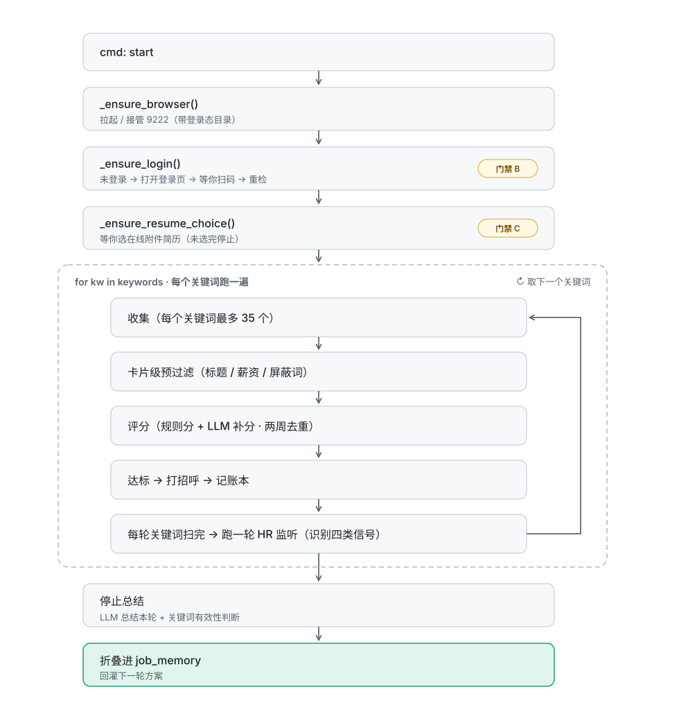

# ARCHITECTURE — 架构说明

## 一、总体：双进程

```
┌──────────────────────────────────────────────┐
│  desktop/  Electron（界面层）                  │
│  ┌────────┐ ┌────────┐ ┌────────┐           │
│  │ pet    │ │ chat   │ │ dash   │  三个窗口  │
│  │ 桌宠窗 │ │ 对话窗 │ │ 看板窗 │           │
│  └────────┘ └────────┘ └────────┘           │
│      main.js —— 主进程 / 窗口管理 / 事件转发    │
└───────────────┬──────────────────────────────┘
                │
     stdout：每行一个 JSON 事件 {"type": ...}
     stdin ：每行一个 JSON 命令 {"cmd": ...}
                │
┌───────────────▼──────────────────────────────┐
│  agent/ + boss/  Python（业务层）              │
│  pet_bridge.py —— 桥接 / 命令分发              │
│  main.py       —— 流程编排 + 状态机            │
│  shared.py     —— 配置 / 评分 / LLM / 浏览器    │
└───────────────┬──────────────────────────────┘
                │ DrissionPage 接管 CDP 9222
                ▼
        你自己登录好的 Chrome
```

**为什么要分成两个进程**

| 理由 | 说明 |
|---|---|
| 业务用 Python | 浏览器自动化、LLM、数据处理生态都在 Python |
| 界面用 Electron | 透明窗、动画帧、多窗口只有 Electron 做得顺手 |
| 用 stdio 通信 | 不引入 IPC 库；Python 只管 `print` 一行 JSON，主进程按行解析转发 |

代价：路径与生命周期要自己管（Python 进程由 Electron 拉起与托管）。

---

## 二、Electron 侧

### 三个窗口

| 窗口 | 文件 | 职责 |
|---|---|---|
| 桌宠窗 | `index.html` + `renderer.js` | 透明无边框，跟随状态切换素材 |
| 对话窗 | `chat.html` + `chat.js` | 打字机输出、状态行、命令路由、选择面板 |
| 看板窗 | `dash.html` | 总览 / 运行中 / 报告 / 设置 四个分区 |

均由 `main.js` 创建（`createPetWindow` / `openChatWindow` / `openDashboardWindow`）。

### 转发规则

```js
// main.js：读 Python 的 stdout，按行解析
JSON.parse(line)
  → win.webContents.send('pet-event', msg)        // 桌宠
  → chatWin.webContents.send('pet-event', msg)    // 对话窗
  → dashWin.webContents.send('pet-event', msg)    // 看板
```

**所有事件都会转发给所有存在的窗口** —— 窗口不存在则丢弃。

> ⚠️ 由此产生一条必须遵守的规则：
> **推送式状态必须支持"窗口打开时回放"**，否则中途打开窗口看到的是空的。
> 典型例子：看板打开时 `main.js` 会补发最近一次 `progress`
> （见 `lastProgress`，参考 `docs/DECISIONS.md`）。

### 安全边界

- `contextIsolation: true`、`nodeIntegration: false`
- 每个窗口有独立 preload：`preload.js` / `chat-preload.js` / `dash-preload.js`
- 渲染进程只能通过 `window.bridge` 收发，拿不到 Node 能力

---

## 三、Python 侧

| 模块 | 职责 |
|---|---|
| `agent/pet_bridge.py` | 读 stdin 命令 → 调 `main.py` 的能力 → `print` JSON 事件 |
| `agent/main.py` | 流程编排、状态机、Tk 隐藏窗承载定时任务 |
| `agent/shared.py` | 配置读写、日志、评分引擎、LLM 客户端、浏览器接管、DOM 工具 |
| `agent/ledger.py` | 动作账本（JSONL 追加） |
| `agent/doctor.py` | 环境自检 |
| `agent/skill_entry.py` | CLI 入口（非桌面路径） |
| `boss/boss_apply.py` | 岗位收集 / 预过滤 / 评分 / 打招呼 |
| `boss/boss_chat.py` | HR 消息监听 / 四类信号处理 / 要简历自动发送 |

### 状态机

`main.py` 维护业务状态，经 `state` 事件推给前端：

```
闲置 ──start──▶ 分析中 ──▶ 投递中 ──▶ 沟通中
  ▲               │            │
  └──── stop ─────┴────────────┘
```

取值：`闲置` / `分析中` / `投递中` / `沟通中` / `停止` / `待命中`

---

## 四、事件协议

### Python → Electron（stdout，每行一个 JSON）

| type | 含义 | 消费者 |
|---|---|---|
| `ready` | 后端就绪 | 全部 |
| `log` | 运行日志 | 对话窗状态行 / 看板 |
| `chat` | 猫说的话 | 对话窗正文 |
| `bubble` | 桌宠气泡 | 桌宠窗 |
| `state` | 业务状态变更 | 全部 |
| `snapshot` | 完整快照（方案、统计、会话） | 看板总览 |
| `progress` | 投递进度 | 看板运行中 |
| `reports` / `report_detail` / `reports_cleared` | 分析报告 | 看板报告 |
| `config` / `models` / `llm_test` | LLM 配置相关 | 看板设置 |
| `hr_inbound` / `hr_alert` | HR 消息 | 对话窗 / 看板 |
| `resume_sent` / `resume_send_failed` / `resume_send_error` | 发简历结果 | 看板 |
| `panel` | 选择面板（如选简历） | 对话窗 |
| `error` | 错误 | 全部 |

> ⚠️ **契约要求**：新增 `type` 时必须**同时**在 `agent/`（发出）和 `desktop/src/`（处理）落地，
> 否则事件会静默丢失。

### Electron → Python（stdin，每行一个 JSON）

`pet_bridge.py` 处理的命令：

| cmd | 含义 |
|---|---|
| `get_state` | 要一份完整快照 |
| `user_text` | 用户说的话（交给 LLM 判断意图） |
| `start` / `stop` / `pause` / `resume` | 任务控制 |
| `update_plan` | 修改投放方案 |
| `save_llm` / `fetch_models` | LLM 配置 |
| `resume_file` / `choice` | 简历文件、序号选择 |
| `confirm_and_start` | 确认并开始 |
| `call` | 通用调用 |

---

## 五、投递主流程

<p align="center">
  
</p>

### 岗位评分

1. **规则分**：关键词命中、薪资区间、屏蔽词、经验年限等
2. **LLM 补分**：规则分接近阈值时调 LLM 精细判断
3. **阈值过滤**：低于 `min_score` 跳过
4. **两周去重**：两周内评估过的直接用缓存分，不再调 LLM

---

## 六、数据落盘

所有运行数据写在仓库根的 `run/`（**已 gitignore**）：

| 文件 | 内容 |
|---|---|
| `config.json` | 配置（含 **LLM API Key**） |
| `plan.json` | 当前投放方案 |
| `job_memory.json` | 已评估岗位 + 关键词统计 |
| `ledger/` | 动作账本 JSONL |
| `reports/` | 分析报告 |
| `chat-state.json` / `chat-memory.json` | 会话状态与记忆 |
| `.job_hunter/` | 浏览器用户目录（**含登录态 Cookie**） |
| `resume.md` | **简历正文** |

详见 [`PRIVACY.md`](PRIVACY.md)。

---

## 七、扩展点

| 想加什么 | 在哪加 |
|---|---|
| 新招聘平台 | `boss/` 下新建适配器；在 `skill_entry.py` 的 `SCRIPT_REGISTRY` 注册 |
| 新城市 | `agent/shared.py` 的 `CITY_CODES`（当前 63 个） |
| 新命令 | `agent/pet_bridge.py` 的 `_dispatch` + 前端 `window.bridge.send` |
| 新事件 | `agent/main.py` 发出 + `desktop/src/*` 处理（**必须成对**） |
| 新看板分区 | `dash.html` 加 `<section class="page">` + 导航按钮 |
